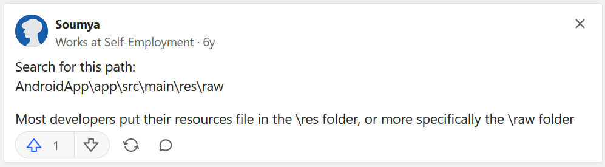

# Phone-Stuff
Used on android Nova Launcher Prime to save the .apk
\
Used http://www.javadecompilers.com/apk to decompile the .apk
\
Followed the path mentioned at https://www.quora.com/How-do-I-extract-a-audio-file-from-a-APK-Android-package-kit
\

\
Found the appropriate files: notification.mp3, ringtone.ogg (Appears as "Office Telephone Ring Loop".)

/storage/emulated/0/Notifications/textnow-notification.mp3
\
/storage/emulated/0/Ringtones/textnow-ringtone.ogg

For extracting the icon of apps for use in other apps I use:
\
https://play.google.com/store/apps/details?id=sk.styk.martin.apkanalyzer
